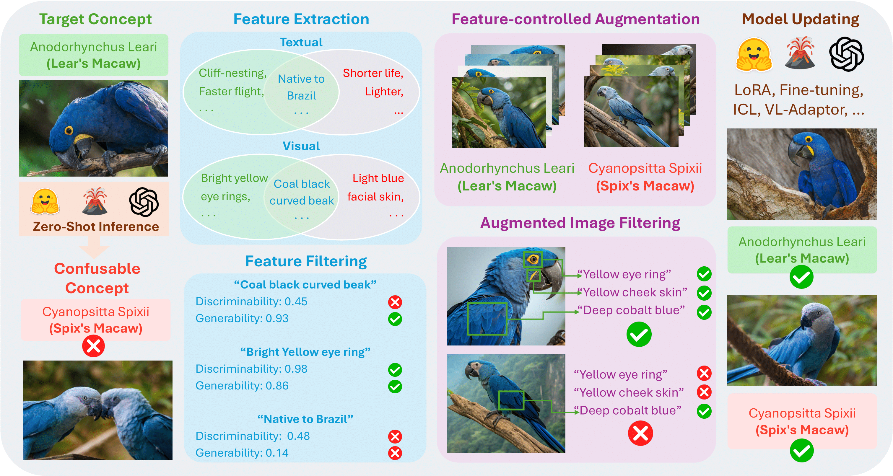

<h1 align="center">Contrastive Visual Data Augmentation</h1>

<p align="center">
    <a href="https://arxiv.org/abs/2502.17709">
        
    </a>
    <a href="https://contrastive-visual-data-augmentation.github.io/">
        
    </a>
    <a href="https://huggingface.co/datasets/uclanlp/CoDA" target="_blank">
        
    <a href="https://opensource.org/licenses/MIT">
        
    </a>

</p>

<p align="center">
    <a href="https://yu-bryan-zhou.github.io/">Yu Zhou*</a>, 
    <a href="https://bingxuanli.com/">Bingxuan Li*</a>, 
    <a href="https://tangmohan.github.io/tangmohan.pdf">Mohan Tang*</a>, 
    <a href="https://scholar.google.com/citations?user=Jd_tsuEAAAAJ">Xiaomeng Jin</a>, 
    <a href="https://telin0411.github.io/">Te-Lin Wu</a>, 
    <a href="https://khhuang.me/">Kuan-Hao Huang</a>, <br>
    <a href="https://blender.cs.illinois.edu/hengji.html">Heng Ji</a>, 
    <a href="https://web.cs.ucla.edu/~kwchang/">Kai-Wei Chang</a>, 
    <a href="https://violetpeng.github.io/">Nanyun Peng</a>
</p>


<p align="center">
    <a href="https://contrastive-visual-data-augmentation.github.io/" target="_blank">
        
    </a>
</p>


## Table of Contents

- [Introduction](#introduction)
- [Quick Start](#quick-start)
- [Bibtex](#acknowledgements)

---

# Introduction

Large multimodal models (LMMs) often struggle to recognize novel concepts, as they rely on pre-trained knowledge and have limited ability to capture subtle visual details. Domain-specific knowledge gaps in training also make them prone to confusing visually similar, commonly misrepresented, or low-resource concepts. To help LMMs better align nuanced visual features with language, improving their ability to recognize and reason about novel or rare concepts, we propose a Contrastive visual Data Augmentation (CoDA) strategy. CoDA extracts key contrastive textual and visual features of target concepts against the known concepts they are misrecognized as, and then uses multimodal generative models to produce targeted synthetic data. Automatic filtering of extracted features and augmented images is implemented to guarantee their quality, as verified by human annotators. We show the effectiveness and efficiency of CoDA on low-resource concept and diverse scene recognition datasets including INaturalist and SUN. We additionally collect NovelSpecies, a benchmark dataset consisting of newly discovered animal species that are guaranteed to be unseen by LMMs. LLaVA-1.6 1-shot updating results on these three datasets show CoDA significantly improves SOTA visual data augmentation strategies by 12.3% (NovelSpecies), 5.1% (SUN), and 6.0% (iNat) absolute gains in accuracy

# Quick Start

## 1. Data Augmentation

### 1.1 CoDA Generation

#### Configuration

Create a `config.json` file in your working directory with the following structure:

```json
{
  "num_imgs_per_class": 100,
  "models": ["34b"],
  "prompts_types": [],
  "synthetic_images_path": PATH,
  "real_images_path": PATH,
  "val_images_path": PATH,
  "pairs": [
    {
      "ground_truth": "class1",
      "ground_truth_full_name": "class1_full",
      "confusing_class": "class2",
      "confusing_class_full_name": "class2_full"
    }
  ]
}
```
(see examples/config.json for reference).

#### Usage

Be sure to prepare the config.json file and put in under the working directory.

Run the script with the following arguments:

```bash
python generation.py --prompts contrastive_visual_text --num_images 50 --num_test 5 --working_dir YOUR_WORKING_PATH
```

##### Arguments

- `--prompts`: Type of prompts to generate (default: "contrastive_visual_text")
- `--num_images`: Number of images to generate per class (default: 50)
- `--num_test`: Number of test images for attribute evaluation (default: 5)
- `--working_dir`: Working directory path


#### Output Structure

```
working_dir/
├── synthetic_improved/
│   └── 34b/
│       └── contrastive_visual_text/
│           └── class_name/
│               ├── attributes.json
│               ├── attributes_contrastiveness_statistics.json
│               └── images/
```

### 1.2 Naive Generation

#### Usage

```bash
python naive_augmentation.py --num_images 50 \
               --output_path OUTPUT_PATH \
               --working_dir WORKING_DIR \
               --prompts flip,crop \
               --SUN False
```

##### Arguments

- `--num_images`: Number of augmented images to generate (default: 50)
- `--output_path`: Output directory path
- `--working_dir`: Working directory containing source images
- `--prompts`: Augmentation types to apply (default: "flip,crop")
- `--SUN`: Flag for SUN dataset directory structure

#### Output Structure

```
output_path/
├── flip/
│   └── class_name/
│       └── augmented_images
├── crop/
│   └── class_name/
│       └── augmented_images
└── failed_pairs.json
```

### 1.3 Verification

#### Usage

Run the script with the required parameters:

```shell
python verification.py --data_config path/to/config.json --output_path path/to/output.json --attributes_prompts text contrastive_text
```

##### Arguments

```
--data_config: Path to the JSON file containing dataset configuration.

--output_path: Path to store the results in JSON format.

--attributes_prompts: List of attribute extraction methods (e.g., text, contrastive_text).
```

##### Data Configuration File

The data_config.json file should contain:

```json
{
  "pairs": [
    {
      "ground_truth": "class1",
      "ground_truth_full_name": "Full Name 1",
      "confusing_class": "class2",
      "confusing_class_full_name": "Full Name 2"
    }
  ],
  "synthetic_images_path": "path/to/synthetic/images",
  "real_images_path": "path/to/real/images"
}
```

#### Output Format

The output JSON file will contain verification scores and extracted attributes in the following format:

```json
{
  "text": {
    "class1": [
      {
        "img": "image1.jpg",
        "target_attributes": ["attribute1", "attribute2"],
        "result": { "attribute1": 1, "attribute2": 0 },
        "score": 0.5
      }
    ]
  }
}
```

## 2. Model Updating

### Usage

Run the script using the following command:

```bash
python finetune.py [arguments]
```

#### Arguments

- `--data_path`: Path to your dataset (default: "YOUR_DATA_PATH")
- `--working_dir`: Working directory for outputs (default: "YOUR_WORKING_DIR")
- `--port`: Ports for distributed training (default: "4,5,6")
- `--base_model`: Base model to fine-tune (default: "liuhaotian/llava-v1.6-34b")
- `--number_of_images`: Number of images per training instance (default: 5)
- `--number_of_epochs`: Number of training epochs (default: 30)
- `--synthetic_imgs_num`: Number of synthetic images (default: 5)
- `--real_imgs_num`: Number of real images (default: 5)
- `--prompt_types`: Comma-separated list of prompt types (default: "contrastive_visual,visual,text")
- `--seed`: Random seed for reproducibility (default: 0)

#### Example

```bash
python finetune.py \
  --data_path /path/to/data \
  --working_dir /path/to/working/dir \
  --number_of_images 10 \
  --number_of_epochs 50 \
  --synthetic_imgs_num 8 \
  --real_imgs_num 8 \
  --prompt_types contrastive_visual,visual
```

### Output Structure

The script creates the following directory structure for each experiment:

```
working_dir/
├── finetune_images/
│   └── {model}_{prompt_type}_{synthetic_num}_{real_num}_{seed}/
│       └── train_data.json
├── ckpts/
│   └── {model}_{prompt_type}_{synthetic_num}_{real_num}_{seed}/
└── logs/
    └── {model}_{prompt_type}_{synthetic_num}_{real_num}_{seed}/
        └── {num_images}_{num_epochs}.log
```

## 3. Model Evaluation

### Usage

```bash
python evaluation.py \
  --data_path /path/to/data \
  --workspace /path/to/workspace \
  --feature_extraction_approachs contrastive_visual \
  --model 34b \
  --num_val 20 \
  --num_epochs 30 \
  --batch_size 5 \
  --zeroshot True
```

### Configuration

Required `config.json` structure:

```json
{
  "pairs": [
    {
      "ground_truth": "class1",
      "ground_truth_full_name": "class1_full",
      "confusing_class": "class2",
      "confusing_class_full_name": "class2_full"
    }
  ],
  "val_images_path": "path/to/val",
  "synthetic_images_path": "path/to/synthetic"
}
```

### Output Structure

Results are saved as JSON files containing confusion matrices:

```json
{
  "class1_VS_class2": {
    "class1": { "class1": 0.8, "class2": 0.2 },
    "class2": { "class1": 0.1, "class2": 0.9 }
  }
}
```

## 4. NovelSpecies Dataset

### Download

To download the NovelSpecies Dataset and our subsets of the [iNaturalist](https://github.com/visipedia/inat_comp/tree/master/2017) and [SUN](https://vision.princeton.edu/projects/2010/SUN/) datasets, please go to our [Huggingface Dataset](https://huggingface.co/datasets/uclanlp/CoDA). The dataset structure is:

```
data/
├── train/
│   └── iNaturalist/
│   |   └── {class_name}
│   |       └── images/
│   └── NovelSpecies/
│   |   └── {class_name}
│   |       └── images/
│   └── SUN/
│       └── {class_name_first_letter}/
│           └── {class_name}/
│               └── images/
├── val/
│   └── iNaturalist/
│   |   └── {class_name}/
│   |       └── images/
│   └── NovelSpecies/
│   |   └── {class_name}/
│   |       └── images/
│   └── SUN/
│       └── {class_name_first_letter}/
│           └── {class_name}/
│               └── images/
```


# BibTex
If you find our work helpful, please kindly cite our work :)
```bash
@article{zhou2025contrastive,
  title={Contrastive Visual Data Augmentation},
  author={Zhou, Yu and Li, Bingxuan and Tang, Mohan and Jin, Xiaomeng and Wu, Te-Lin and Huang, Kuan-Hao and Ji, Heng and Chang, Kai-Wei and Peng, Nanyun},
  journal={arXiv preprint arXiv:2502.17709},
  year={2025}
} 
```
